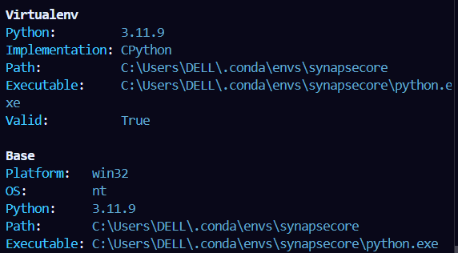

# SynapseCore: A Modular Multimodal AI Engine for Vision–Language Learning


## Dev Instructions  

### Initial Set Up

Step 0:  
You may activate your conda env if you prefer.  

* ```conda create -n synapsecore python=3.11.9```  
* ```conda activate synapsecore```  
* ```conda config --add channels conda-forge```
* ```conda config --set channel_priority strict```

Step 1 (run these cmds **in you project directory**):

* ```pip install pipx```  
* ```pipx install poetry```  
* ```poetry install```  

Step 2 (Only if you use conda env):

* check python used by poetry with ```poetry env info```
* Ensure ```\.conda\envs\synapsecore\``` in Path and Executable

* If you don't see ```.conda```, run ```where.exe python``` and copy path to your choosen conda env python.
* Now run ```poetry use <path/to/python.exe>``` and check ```poetry env info```.

_*Use ```poetry run python main.py``` to run python files.*_

Now we are good to go.  

>**Note:**  
>
>* poetry checks for python version match (current synapsecore uses python 3.11.9 or >=3.11). You can check in pyproject.toml  
>* If fails poetry automatically changes python path or shows error.
